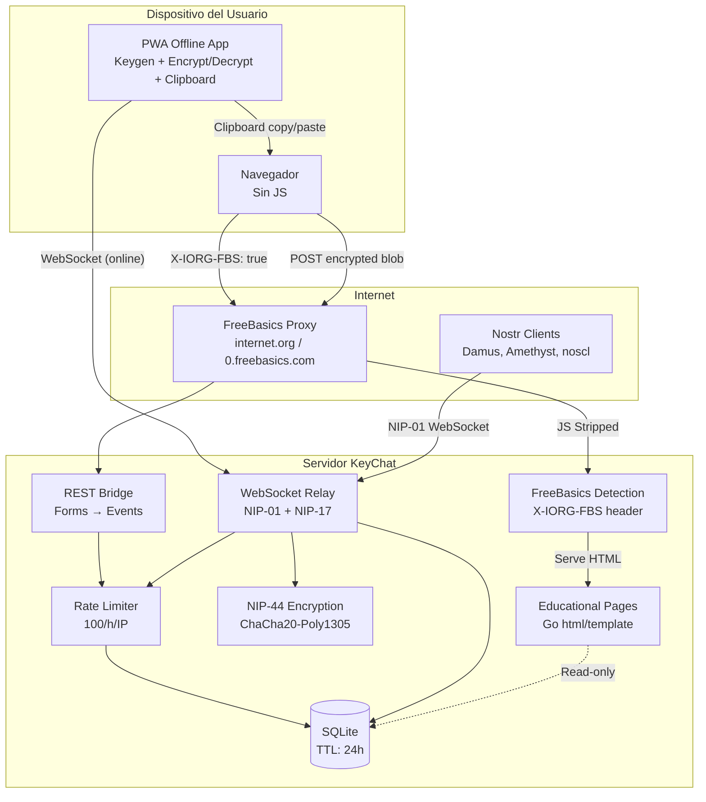
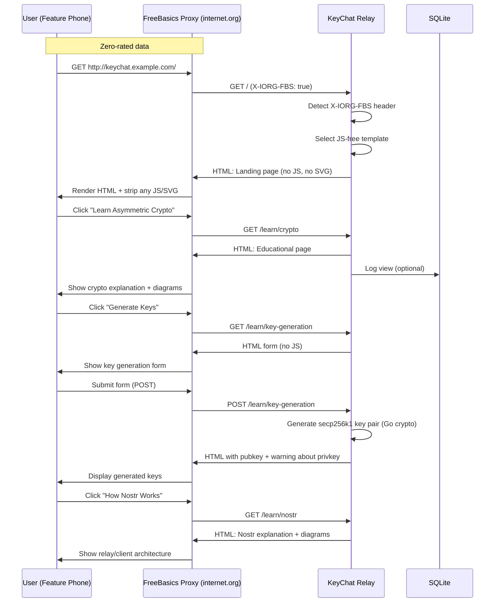
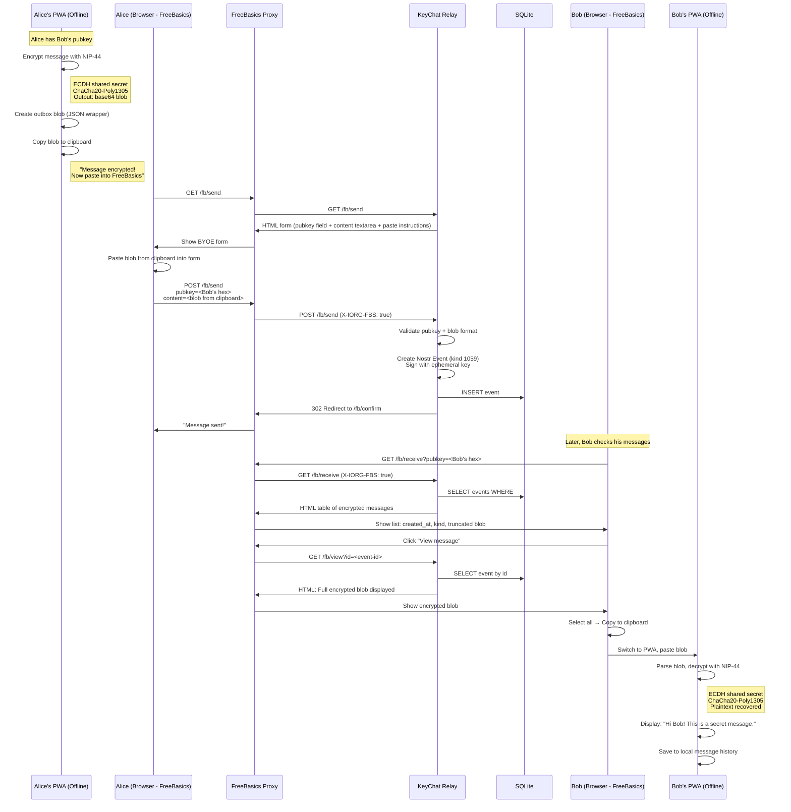
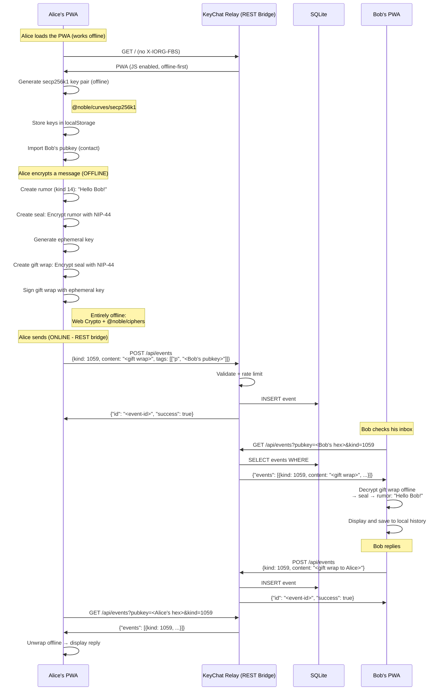
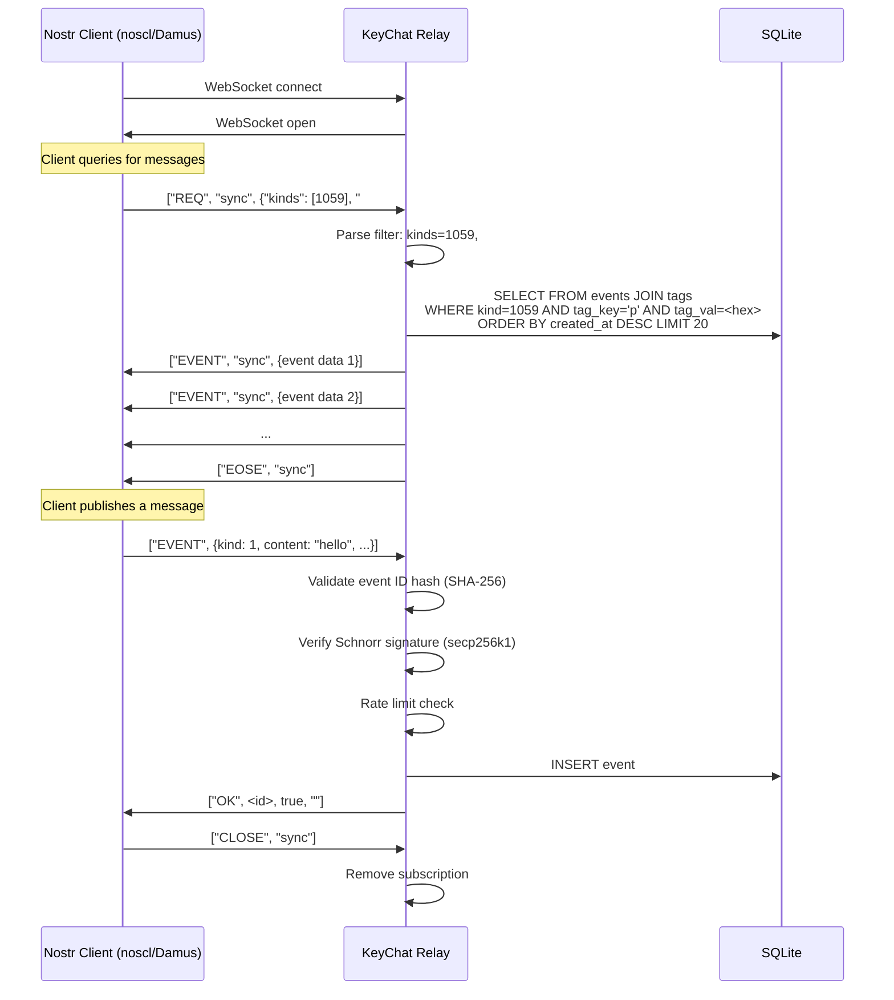
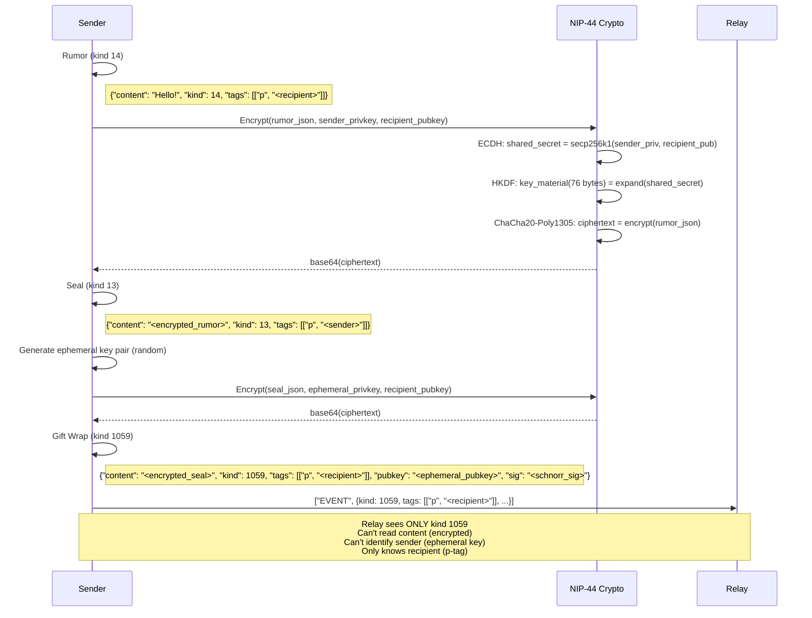
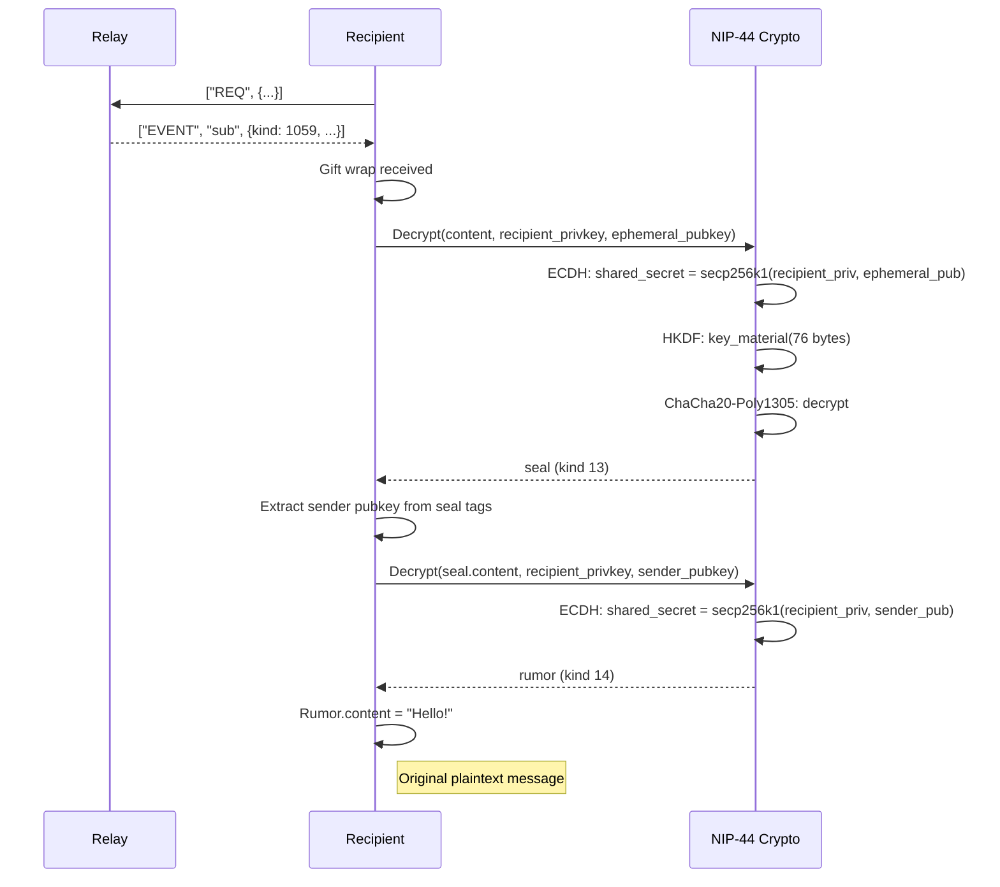

# KeyChat Architecture

> Sistema educativo de criptografía asimétrica + relay Nostr con mensajería privada.
> Doble cara: FreeBasics (zero-rated, sin JS) y acceso directo (full app).

---

## Tabla de Contenidos

1. [Vista General](#1-vista-general)
2. [Flujo FreeBasics: Contenido Educativo](#2-flujo-freebasics-contenido-educativo)
3. [Flujo FreeBasics: BYOE (Bring Your Own Encryption)](#3-flujo-freebasics-byoe-bring-your-own-encryption)
4. [Flujo Directo: Mensajería con JS](#4-flujo-directo-mensajería-con-js)
5. [Flujo Nostr: Cliente Externo](#5-flujo-nostr-cliente-externo)
6. [Flujo Interno: Gift Wrap NIP-17](#6-flujo-interno-gift-wrap-nip-17)
7. [Arquitectura del Relay](#7-arquitectura-del-relay)
8. [Modelo de Datos](#8-modelo-de-datos)

---

## 1. Vista General



---

## 2. Flujo FreeBasics: Contenido Educativo

El usuario accede al contenido educativo **sin gastar datos**. El proxy de Internet.org quita el JS, y el relay detecta el header `X-IORG-FBS` para servir HTML puro.



---

## 3. Flujo FreeBasics: BYOE (Bring Your Own Encryption)

El usuario tiene su clave privada **solo en su dispositivo móvil**, dentro de la PWA offline. La PWA cifra el mensaje (sin conexión a internet), y el usuario copia el blob cifrado al clipboard. Luego cambia al navegador FreeBasics (o al mismo navegador sin PWA) y pega el blob en un form. El servidor **nunca ve el texto plano ni la clave privada**.



---

## 4. Flujo Directo: PWA con REST Bridge

Cuando se accede **sin el proxy de FreeBasics**, el relay sirve la PWA offline-first. Toda la criptografía ocurre **client-side** (offline), y el envío/recepción de mensajes usa el REST bridge HTTP cuando hay conexión. El PWA **no usa WebSocket directo** — usa los mismos endpoints HTTP que FreeBasics, pero con JS para automatizar el copy/paste.



---

## 5. Flujo Nostr: Cliente Externo

Un cliente Nostr existente (Damus, Amethyst, noscl) puede conectarse al relay KeyChat como a cualquier relay Nostr estándar.



---

## 6. Flujo Interno: Gift Wrap NIP-17

Cómo se construye y desarma un mensaje cifrado NIP-17 (triple wrapping).

### Construcción (Sender)



### Destrucción (Recipient)



---

## 7. Arquitectura del Relay

```
┌──────────────────────────────────────────────────────────────┐
│                    cmd/keychat (main)                         │
├──────────────────────────────────────────────────────────────┤
│                                                               │
│  ┌──────────────────────────────────────────────────────┐    │
│  │              HTTP Router (net/http)                    │    │
│  │                                                       │    │
│  │  ┌──────────────┐  ┌──────────────┐  ┌────────────┐  │    │
│  │  │ /learn/*     │  │ /fb/*        │  │ /app/*     │  │    │
│  │  │ Educational  │  │ REST Bridge  │  │ SPA        │  │    │
│  │  │ Pages (HTML) │  │ (HTML+JSON)  │  │ (JS App)   │  │    │
│  │  └──────────────┘  └──────────────┘  └────────────┘  │    │
│  │                                                       │    │
│  │  ┌──────────────────────────────────────────────────┐ │    │
│  │  │  FreeBasics Detection Middleware                  │ │    │
│  │  │  - X-IORG-FBS check                              │ │    │
│  │  │  - Via header check                              │ │    │
│  │  │  - Route bifurcation                             │ │    │
│  │  └──────────────────────────────────────────────────┘ │    │
│  │                                                       │    │
│  │  ┌──────────────────────────────────────────────────┐ │    │
│  │  │  WebSocket Handler (/ws)                          │ │    │
│  │  │  - NIP-01: REQ, EVENT, CLOSE, EOSE, OK           │ │    │
│  │  │  - Connection manager (goroutine per conn)        │ │    │
│  │  │  - Subscription manager                           │ │    │
│  │  │  - Ping/pong keepalive                            │ │    │
│  │  └──────────────────────────────────────────────────┘ │    │
│  └──────────────────────────────────────────────────────┘    │
│                                                               │
│  ┌──────────────────────────────────────────────────────┐    │
│  │  internal/crypto                                      │    │
│  │  - NIP-44: ChaCha20-Poly1305 + HKDF + ECDH            │    │
│  │  - Schnorr: secp256k1 signature validate              │    │
│  └──────────────────────────────────────────────────────┘    │
│                                                               │
│  ┌──────────────────────────────────────────────────────┐    │
│  │  internal/relay                                       │    │
│  │  - NIP-01: Event, Filter, Subscription types          │    │
│  │  - NIP-17: GiftWrap, Seal, Rumor                      │    │
│  │  - RateLimiter (xsync map, 100/h/IP)                  │    │
│  │  - TTL cleanup (24h, 30min ticker)                    │    │
│  └──────────────────────────────────────────────────────┘    │
│                                                               │
│  ┌──────────────────────────────────────────────────────┐    │
│  │  internal/storage                                     │    │
│  │  - SQLite (modernc.org/sqlite, no CGO)                │    │
│  │  - events table                                       │    │
│  │  - event_tags table (for #p, #e lookups)             │    │
│  │  - NIP-01 filter → SQL translation                   │    │
│  │  - TTL-based deletion                                 │    │
│  │  - WAL mode (concurrent reads)                        │    │
│  └──────────────────────────────────────────────────────┘    │
│                                                               │
│  ┌──────────────────────────────────────────────────────┐    │
│  │  internal/bridge                                      │    │
│  │  - FreeBasics form handlers (GET/POST)                 │    │
│  │  - BYOE event creation (REST → event → store)         │    │
│  │  - CSRF tokens for forms                              │    │
│  └──────────────────────────────────────────────────────┘    │
│                                                               │
│  ┌──────────────────────────────────────────────────────┐    │
│  │  internal/templates                                   │    │
│  │  - base.html (Go html/template)                      │    │
│  │  - pages/ (5 educational pages)                      │    │
│  │  - fb/ (FreeBasics portal pages)                     │    │
│  │  - CSS design system (no framework, <50KB)           │    │
│  └──────────────────────────────────────────────────────┘    │
└──────────────────────────────────────────────────────────────┘

┌──────────────────────────────────────────────────────────────┐
│                    web/ (PWA Client)                          │
├──────────────────────────────────────────────────────────────┤
│  - src/crypto/: NIP-44 + NIP-17 + key generation            │
│  - src/pwa/: keystore, contacts, clipboard blobs, history    │
│  - src/ui/: key management, compose, inbox, contacts UI     │
│  - sw.ts: Service Worker (offline caching)                   │
│  - public/manifest.json: PWA install manifest               │
└──────────────────────────────────────────────────────────────┘

┌──────────────────────────────────────────────────────────────┐
│                    web/ (JS SPA)                              │
├──────────────────────────────────────────────────────────────┤
│  src/                                                         │
│  ├── crypto/                                                  │
│  │   ├── nip44.ts  (ChaCha20-Poly1305, ECDH, HKDF)          │
│  │   ├── nip17.ts  (Gift wrap/unwrap)                        │
│  │   └── keys.ts   (Key generation, storage)                  │
│  ├── nostr/                                                   │
│  │   ├── client.ts (WebSocket client, reconnection)          │
│  │   ├── event.ts  (Event creation, signing)                  │
│  │   └── filter.ts (Filter helpers)                           │
│  ├── store/                                                   │
│  │   └── keys.ts   (localStorage key management)              │
│  └── ui/                                                      │
│      ├── app.ts       (SPA router)                            │
│      ├── keygen.ts    (Key generation screen)                 │
│      ├── contacts.ts  (Contact management)                    │
│      ├── compose.ts   (Message composition)                   │
│      └── inbox.ts     (Message inbox)                         │
└──────────────────────────────────────────────────────────────┘
```

### Dependencia entre Paquetes

```
cmd/keychat
    ├── internal/relay    (types, nip01, nip17, ratelimit, cleanup)
    │   ├── internal/crypto (nip44, schnorr)
    │   └── internal/storage (sqlite)
    ├── internal/bridge    (freebasics http handlers)
    │   └── internal/relay
    └── internal/templates (go html/templates)
```

---

## 8. Modelo de Datos

### SQLite Schema

```sql
-- Core events table
CREATE TABLE events (
    id         TEXT PRIMARY KEY,      -- NIP-01 event ID (SHA-256 hash, hex)
    pubkey     TEXT NOT NULL,         -- Author pubkey (64 hex chars)
    created_at INTEGER NOT NULL,      -- Unix timestamp
    kind       INTEGER NOT NULL,      -- Nostr kind (1, 4, 14, 1059, etc.)
    content    TEXT NOT NULL,         -- Event content (encrypted for NIP-17)
    sig        TEXT NOT NULL,         -- Schnorr signature (128 hex chars)
    created    TEXT NOT NULL DEFAULT (datetime('now'))  -- When stored
);

-- Tag index for efficient #p, #e lookups
CREATE TABLE event_tags (
    id       INTEGER PRIMARY KEY AUTOINCREMENT,
    event_id TEXT NOT NULL REFERENCES events(id) ON DELETE CASCADE,
    key      TEXT NOT NULL,           -- Tag key (e.g. 'p', 'e', 't')
    value    TEXT NOT NULL            -- Tag value (e.g. pubkey hex)
);

-- Performance indexes
CREATE INDEX idx_events_pubkey     ON events(pubkey);
CREATE INDEX idx_events_kind       ON events(kind);
CREATE INDEX idx_events_created_at ON events(created_at);
CREATE INDEX idx_tags_key_value    ON event_tags(key, value);
CREATE INDEX idx_tags_event_id     ON event_tags(event_id);
```

### NIP-01 Filter → SQL Translation

| Filter | SQL |
|--------|------|
| `{"ids": ["a", "b"]}` | `WHERE id IN ('a', 'b')` |
| `{"authors": ["x"]}` | `WHERE pubkey IN ('x')` |
| `{"kinds": [1, 4]}` | `WHERE kind IN (1, 4)` |
| `{"#p": ["hex"]}` | `JOIN event_tags ON event_id = id WHERE key='p' AND value IN ('hex')` |
| `{"since": 100, "until": 200}` | `WHERE created_at >= 100 AND created_at <= 200` |
| `{"limit": 10}` | `ORDER BY created_at DESC LIMIT 10` |

### Estructura de Eventos Nostr

**Rumor (kind 14) — texto plano interno**
```json
{
  "id": "<sha256>",
  "pubkey": "<sender_hex>",
  "created_at": 1700000000,
  "kind": 14,
  "tags": [["p", "<recipient_hex>"]],
  "content": "Hello Bob! This is the plaintext message.",
  "sig": "<schnorr_sig>"
}
```

**Seal (kind 13) — rumor cifrado**
```json
{
  "id": "<sha256>",
  "pubkey": "<sender_hex>",
  "created_at": 1700000001,
  "kind": 13,
  "tags": [["p", "<sender_hex>"]],
  "content": "<NIP-44 encrypted rumor JSON>",
  "sig": "<schnorr_sig>"
}
```

**Gift Wrap (kind 1059) — seal cifrado (lo que ve el relay)**
```json
{
  "id": "<sha256>",
  "pubkey": "<ephemeral_hex>",     ← NO es el sender real
  "created_at": 1700000002,
  "kind": 1059,
  "tags": [["p", "<recipient_hex>"]],
  "content": "<NIP-44 encrypted seal JSON>",
  "sig": "<schnorr_sig firmado con ephemeral key>"
}
```

---

## Leyenda

```
─── → Request/Response síncrono
─‧─ → WebSocket (bidireccional, persistente)
-→  → Llamada interna/función
═══ → Límite de subsistema
```

---

*KeyChat v1 — Arquitectura documentada con Mermaid.js*
